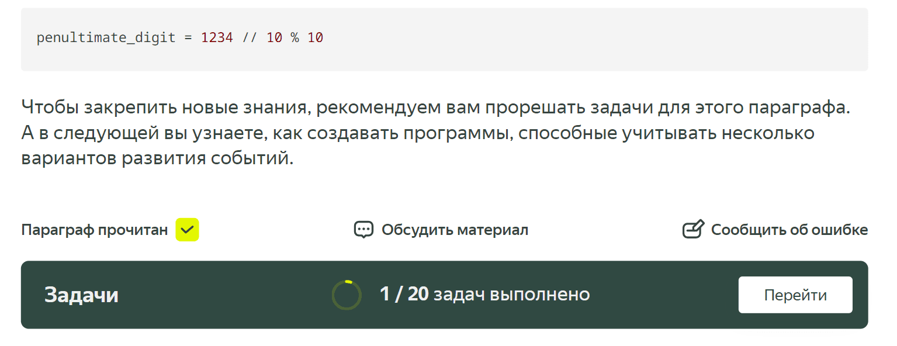
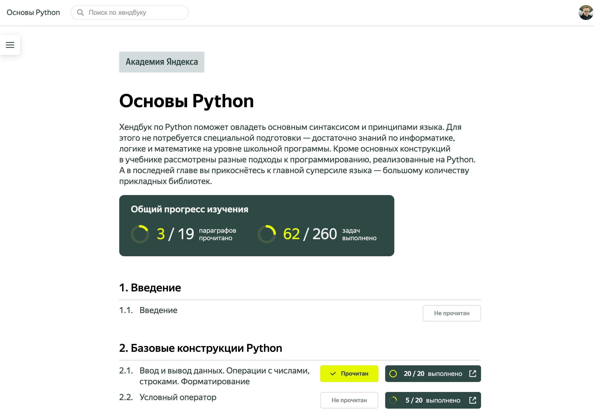
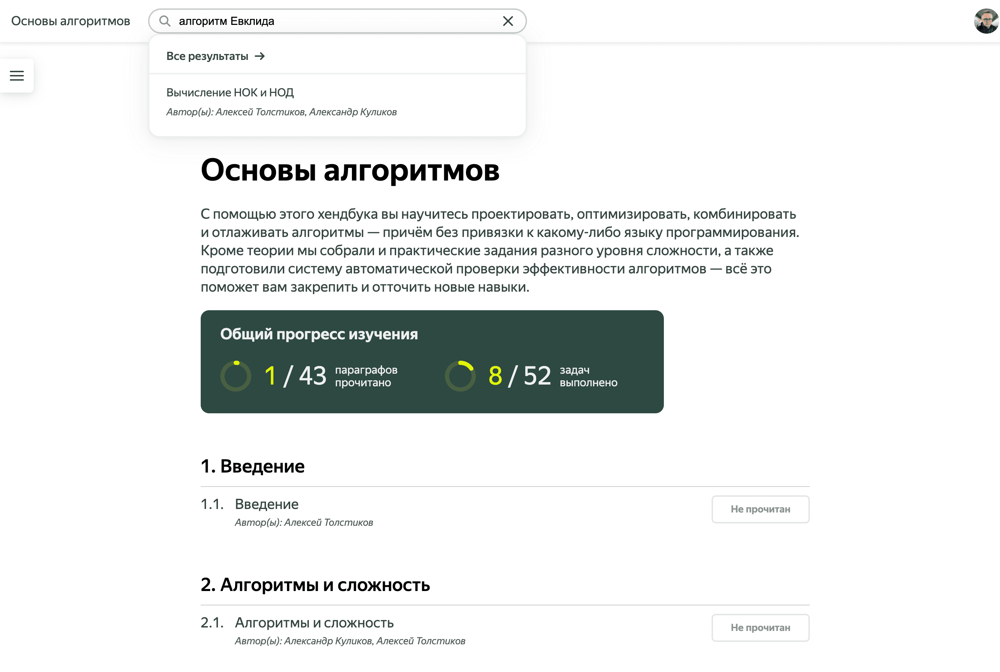
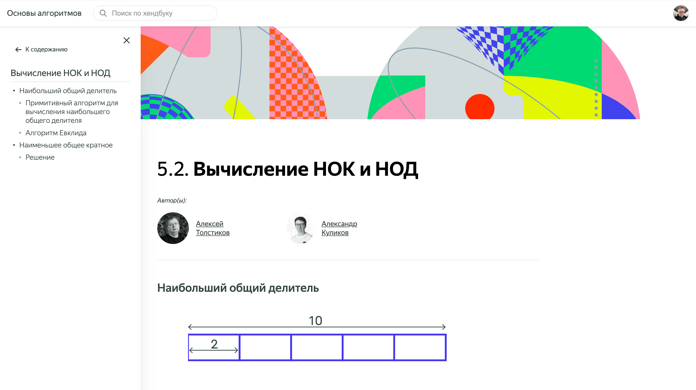

# Как пользоваться хендбуком

Если вы хотите вернуться к параграфу попозже, то можете оставить закладку на том месте, где вы остановились.

Для этого можно отметить главы как прочитанные:

Это отразится на странице содержания и в прогресс-баре хендбука:

А если вам нужно быстро найти какую-то тему или понятие — вы можете воспользоваться поиском:

И навигацией внутри страниц:

В конце каждого параграфа вы можете перейти в комьюнити, чтобы обсудить тему или задачи к ней, а также перейти к самим задачам:

Вот и всё! Как видите, это не сложно. Надеемся, у вас всё получится. А если нет — вступайте в [коммьюнити](https://t.me/handbook_python)  хендбука: там вам обязательно придут на помощь.